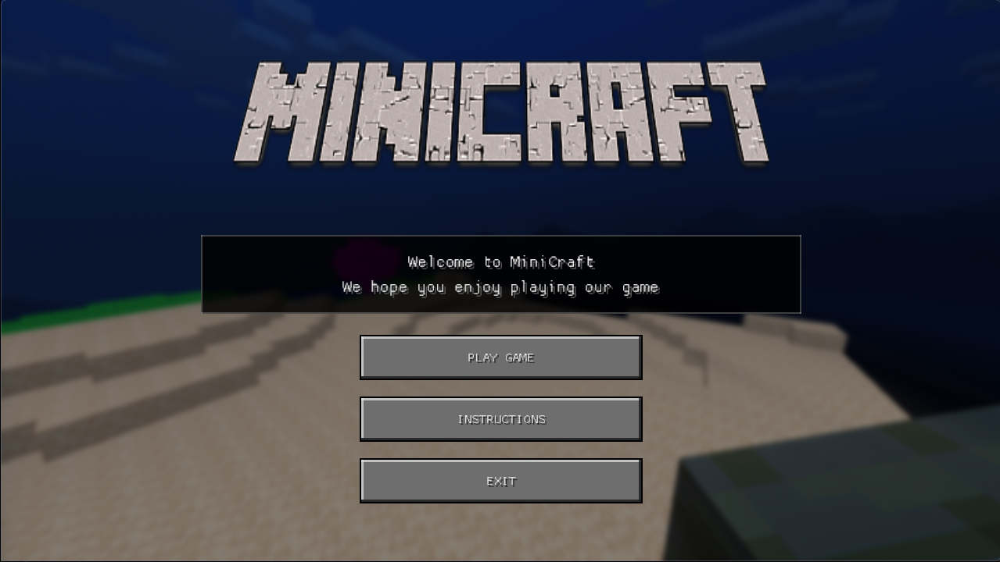
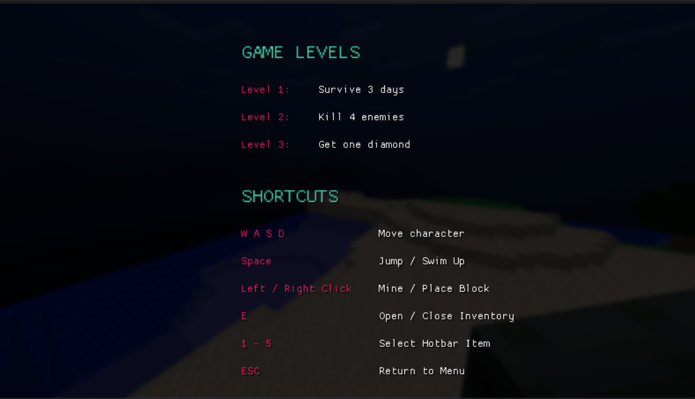
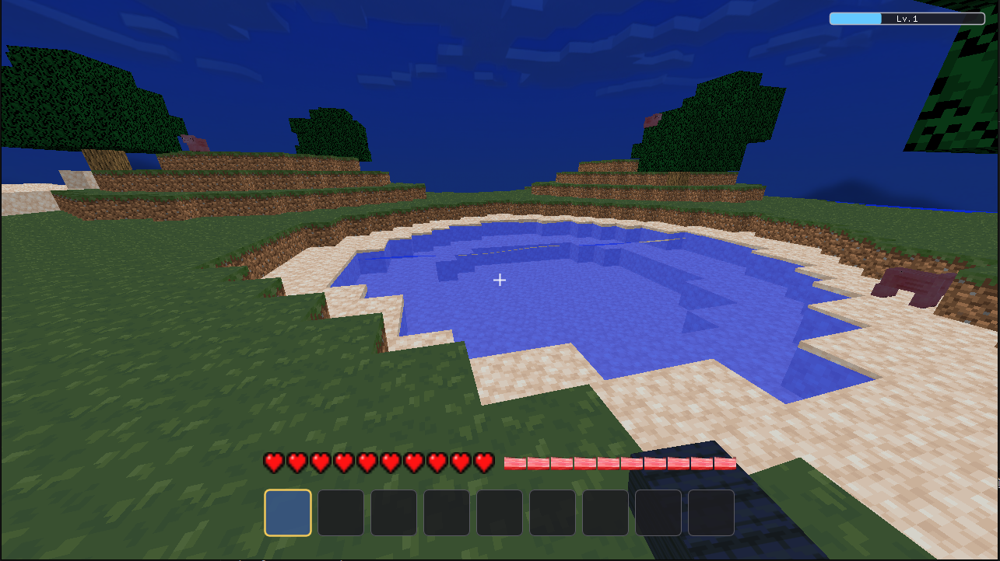
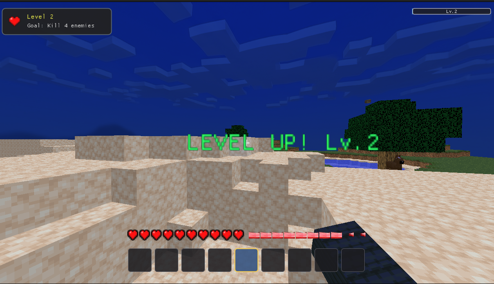
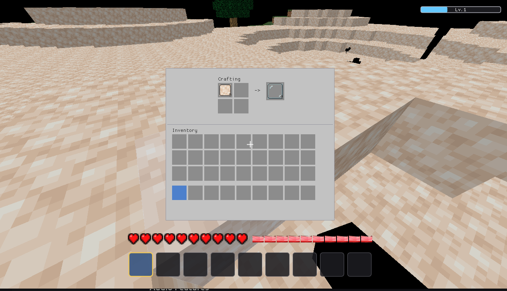
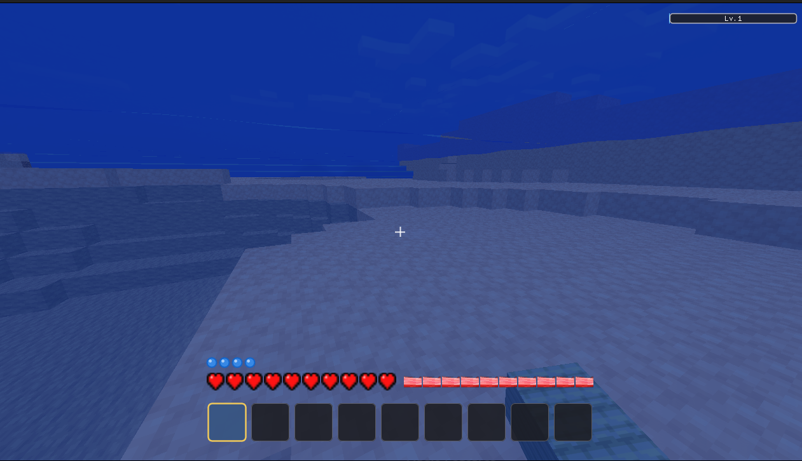

<p align="center">
  
</p>

A captivating voxel-based sandbox game inspired by Minecraft, built with modern C++ and OpenGL. Experience block-based world building, survival mechanics, engaging audio, and a fully immersive gaming experience with Minecraft-style textures and aesthetics.

---

## 🎮 Game Features

### Core Gameplay

- **Block-Based World Building**: Place and destroy blocks to create your own structures
- **Minecraft Textures**: Authentic block textures recreating the classic Minecraft aesthetic
- **Dynamic Lighting System**: Real-time lighting with dynamic shadows and ambient occlusion
- **Interactive UI**: Intuitive game interface for inventory, crafting, and settings
- **Persistent World**: Save and load your creations

### Entities & NPCs

- **Three Enemy Types**: Encounter diverse hostile mobs with unique behaviors
- **Animal Companions**: Discover peaceful wildlife in your world
- **Advanced AI**: Intelligent pathfinding and behavior systems

### Audio & Immersion

- **Sound Effects**: Rich audio feedback for interactions, combat, and environmental events
- **Spatial Audio**: Direction-aware sound positioning

### Graphics & Visuals

- **Voxel Rendering**: Efficient chunk-based rendering system
- **Post-Processing Effects**: Visual enhancements and special effects
- **Weather System**: Dynamic environmental conditions
- **Particle Effects**: Visual feedback for actions and events

---

## Inspired by Minecraft

Minicraft draws inspiration from Minecraft's iconic block-based world design and visual style. We've recreated the essence of voxel-based gameplay while building our own rendering engine and expanding with unique features, immersive audio, and engaging entity interactions. This project celebrates the creative freedom of sandbox gaming.

---

## All Features & Systems

### World Generation & Management

- Block-based voxel world with dynamic loading
- Chunk system for efficient memory and rendering
- Save/load persistent worlds
- Dynamic lighting and shadow rendering

### Entity Systems

- Advanced AI pathfinding for enemies and animals
- Entity collision detection and physics
- Behavior trees for complex NPC interactions
- Animation system for entities

### Gameplay Mechanics

- Mining and block destruction with durability
- Inventory system with item management
- Crafting recipes and crafting table
- Item dropping and pickup system
- Player health and damage system
- Respawn mechanics

### Combat & Interaction

- Attack and combat system
- Enemy drop mechanics
- Interaction zones and callbacks

### Visual Polish

- Dynamic camera system
- Entity animations and skeletal rigging
- Particle systems for effects
- Screen shake and visual feedback
- Transparency and alpha blending
- Fog and distance culling

---

## Screenshots & Visuals

### User Interface

<table align="center">
  <tr>
    <td align="center">
      <br>
      Main Menu
    </td>
    <td align="center">
      <br>
      Instructions
    </td>
    <td align="center">
      <br>
      Game UI
    </td>
  </tr>
  <tr>
    <td align="center">
      <br>
      In-Game UI
    </td>
    <td align="center">
      <br>
      Inventory
    </td>
    <td align="center">
      <br>
      Water
    </td>
  </tr>
</table>

---

## Audio Features

- **Ambient Music**: Dynamic background music that adapts to gameplay
- **Sound Effects**:
  - Block breaking and placing sounds
  - Enemy attacks and ambient noises
  - Animal vocalizations
  - UI interaction sounds

---

## Building & Installation

### Prerequisites

- **C++ Compiler** (C++17 standard)
- **CMake** 3.5.0 or higher
- **OpenGL** 3.3 or higher
- **Linux/macOS/Windows** with appropriate development tools

### Build Instructions

```bash
# Clone the repository
git clone <repository-url>
cd Graphics-project

# Create build directory
mkdir build
cd build

# Configure and build
cmake ..
make

# Run the application
./bin/GAME_APPLICATION
```

### Linux Dependencies

```bash
sudo apt-get install build-essential cmake libgl1-mesa-dev libglew-dev
```

---

## Gameplay Guide

### Getting Started

```bash
./bin/GAME_APPLICATION
```

### Controls

- **WASD**: Move around the world
- **Mouse**: Look around and aim
- **Click**: Break/Place blocks
- **E**: Open inventory
- **Esc**: Open menu

### Configuration

Game settings can be customized via JSON configuration files in the `config/` directory:

- `app.jsonc` - Main game configuration
- World and gameplay settings
- Audio and graphics preferences

## 📁 Project Structure

```
Graphics-project/
├── source/                  # Game source code
│   ├── main.cpp            # Game entry point
│   ├── common/             # Shared systems
│   │   ├── application.hpp/cpp
│   │   ├── asset-loader.hpp/cpp
│   │   ├── shader/         # Graphics & shader system
│   │   ├── input/          # Keyboard & mouse input
│   │   └── components/     # Game entities (enemies, animals, player, UI)
│   └── states/             # Game states (menu, play, etc.)
├── assets/                 # Game assets
│   ├── shaders/           # GLSL shader files
│   ├── models/            # 3D models (enemies, animals, blocks)
│   ├── textures/          # Minecraft-style textures & UI sprites
│   └── sounds/            # Audio files (music, effects, ambient)
├── config/                # Game configuration files
│   ├── app.jsonc          # Main game config
│   └── level-configs/     # World & gameplay settings
├── vendor/                # Third-party libraries
│   ├── glfw/             # Window management
│   ├── glad/             # OpenGL loader
│   ├── glm/              # Math library
│   ├── imgui/            # UI library
│   ├── miniaudio/        # Audio engine
│   └── json/             # JSON parsing
├── build/                 # Build output (generated)
├── bin/                   # Game executable (generated)
└── CMakeLists.txt         # Build configuration
```

---

## Game Development

### Code Style

- Use C++17 standard features
- Follow consistent naming conventions (snake_case for functions, PascalCase for classes)
- Include comprehensive documentation for systems

### Adding Game Content

1. **New Enemies/Animals**: Create entity components in `source/common/components/`
2. **New Blocks/Items**: Add to asset system with texture definitions
3. **New Audio**: Place in `assets/sounds/` and register in audio manager
4. **UI Elements**: Extend ImGui-based interface in game states
5. **Game Logic**: Implement in appropriate game state files under `source/states/`

### Asset Guidelines

- **Models**: Use OBJ or binary mesh formats compatible with asset loader
- **Textures**: Minecraft-style 16x16 or 32x32 pixel textures
- **Audio**: Support for common formats (WAV, MP3)
- **Shaders**: GLSL compatibility with OpenGL 3.3+

---

## Technologies & Dependencies

- **GLFW**: Cross-platform window and input management
- **GLAD**: Modern OpenGL loader (3.3+)
- **GLM**: High-performance mathematics for 3D graphics
- **Dear ImGui**: Real-time UI rendering and menus
- **Miniaudio**: Powerful audio engine for music and sound effects
- **JSON**: Configuration file parsing for game settings
- **OpenGL**: Modern graphics rendering

All dependencies are included in the `vendor/` directory for easy building.

---

## Contributors

| <a href="https://avatars.githubusercontent.com/Esraa-Hassan0?v=4"></a> | <a href="https://avatars.githubusercontent.com/hagar3bdelsalam?v=4"></a> | <a href="https://avatars.githubusercontent.com/Safan05?v=4"></a> | <a href="https://avatars.githubusercontent.com/mohamedYasserElbatesh?v=4"></a> |
| :----------------------------------------------------------------------------------------------------------------------------------------------------------------------: | :------------------------------------------------------------------------------------------------------------------------------------------------------------------------------: | :------------------------------------------------------------------------------------------------------------------------------------------------------------: | :----------------------------------------------------------------------------------------------------------------------------------------------------------------------------------------: |
|                                                             [Esraa Hassan](https://github.com/Esraa-Hassan0)                                                             |                                                              [Hagar Abdelsalam](https://github.com/hagar3bdelsalam)                                                              |                                                          [Abdallah Safan](https://github.com/Safan05)                                                          |                                                                 [Mohamed Yasser](https://github.com/mohamedYasserElbatesh)                                                                 |
